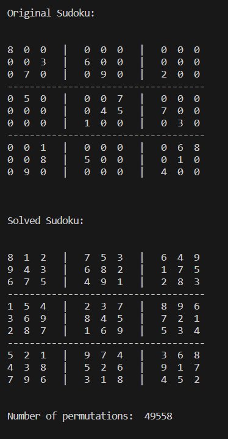

# Sudoku Solver

A simple terminal-based sudoku solver that can solve any given sudoku with varying difficulties. It can also display the number of times the program ran to arrive at the solution while showing all permutations visually.

## Table of Contents
- [Purpose](#purpose)
- [Technologies and Libraries Used](#technologies-and-libraries-used)
- [Setup](#setup)
- [Repository Information](#repository-information)
- [Functions](#functions)
- [Usage](#usage)
- [Output](#output)

## Purpose
I created this project to learn more about backtracking algorithms and to practice my Python skills. Due to my avid interest in sudoku, I wanted to create a sudoku solver that would be capable of solving any sudoku. I also wanted to add the functionality to show all permutations visually and to display the number of times the program ran to arrive at the solution. 

## Technologies and Libraries Used
- Programming Language
    - Python

## Setup
Make sure you have the latest version of Python installed.

## Repository Information
This repository has a single main.py python file.

## Usage
To use the application:
- Edit the two-dimensional board variable in main.py to contain the sudoku you want to solve. Use 0 for empty spaces.
- Run the main.py file.
- The program will display the original board and the solved board with the number of times the application ran to arrive at the solution.
- The main.py file can be edited to display all permutations visually.

